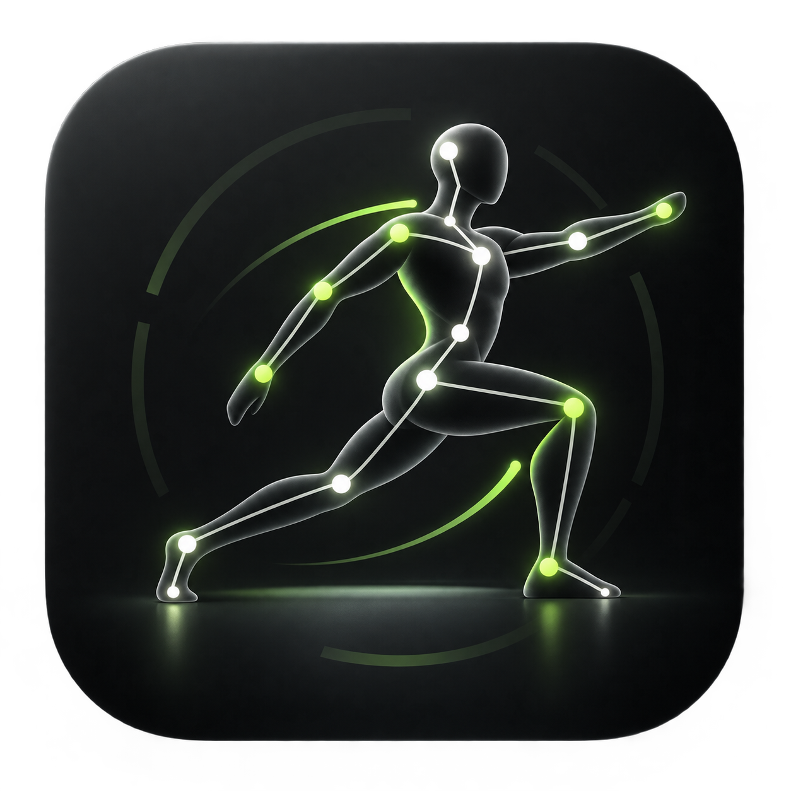
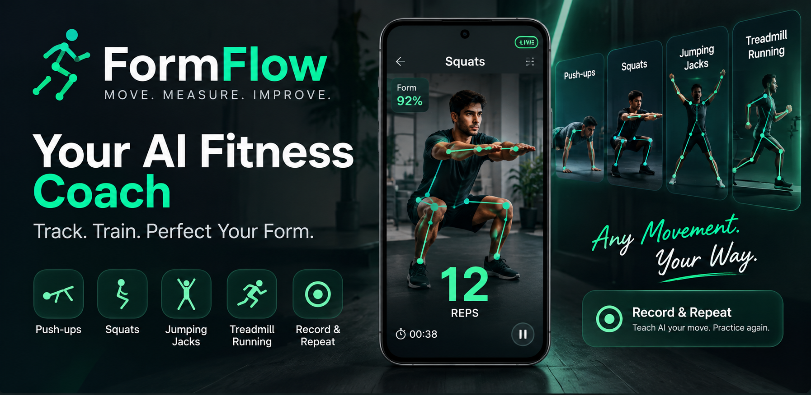

# FormFit

<div align="center">



### Practice movement. Build better form.

FormFit is an on-device movement coach that uses camera-based pose dynamics to evaluate exercise form, track progress, and help users repeat reference movements.

</div>

## App preview

<div align="center">


<br />
</div>

## Features

- MOVING / NOT_MOVING / UNCERTAIN motion state
- STATIONARY / WALKING / RUNNING / UNKNOWN activity classification
- Cadence estimation in steps per minute
- Pose quality, tracking quality, movement intensity, gait confidence, and debug metrics
- Camera viewpoint awareness, calibration, adaptive thresholds, partial-body handling, and recovery logic
- Optional accelerometer/gyroscope down-weighting for phone movement
- Pose-frame replay and metrics recording for deterministic tuning
- No GPS, backend, frame upload, video recording, or biometric identification

## How it works

FormFit keeps six lower-body landmarks, smooths their coordinates with an EMA, normalizes them around the hip center, detects repeated alternating leg phase transitions, and calculates cadence from confirmed step events. All processing remains on-device.

```text
CameraX -> ML Kit -> PoseFrame -> MotionGuard SDK -> MotionEngine -> MotionGuardResult
```

## Modules

- `motionguard-core`: platform-independent preprocessing, gait analysis, cadence, calibration, and replay utilities
- `motionguard-mlkit`: ML Kit Pose to `PoseFrame` adapter
- `motionguard-camera`: CameraX `ImageAnalysis.Analyzer` integration
- `motionguard-sensors`: optional Android `SensorManager` adapter
- `motionguard-sdk`: public developer-facing facade
- `app`: FormFit sample application

## Requirements

- Android min SDK 24+
- Kotlin
- Camera permission when camera input is used
- Google ML Kit when using the ML Kit or CameraX modules

## Quick start

```kotlin
val motionGuard = MotionGuard.Builder(applicationContext)
    .profile(MotionProfile.DEFAULT)
    .enableCalibration(true)
    .enableSensorFusion(false)
    .enableDebugMetrics(false)
    .build()

motionGuard.start()

lifecycleScope.launch {
    motionGuard.results.collect { result ->
        println(result.motionState)
        println(result.activity)
        println(result.cadenceSpm)
        println(result.confidence)
    }
}
```

Call `motionGuard.release()` when the integration is finished.

## Build and test

From the project root:

```powershell
.\gradlew.bat :app:assembleDebug
.\gradlew.bat test
```

## Privacy

FormFit runs on-device. It does not upload camera frames or pose landmarks, record video, use GPS, perform facial recognition, or identify users biometrically. Optional debug CSV logs contain only algorithmic metrics.

## Limitations

Poor lighting, severe cropping, loose clothing, steep camera angles, and unstable ML Kit tracking can produce `UNCERTAIN`. Pose heuristics are not a perfect anti-cheat system and should be tuned with real treadmill footage.

## Roadmap

- API compatibility validation
- More recorded pose replay fixtures
- Threshold tuning across front, side, oblique, low, and elevated camera placements
- Optional published artifacts for Maven Central or GitHub Packages
